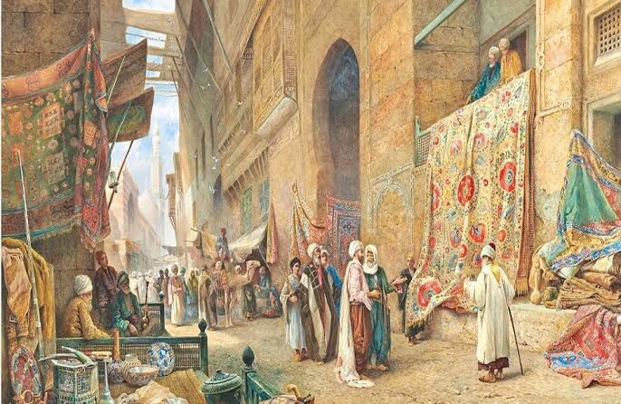
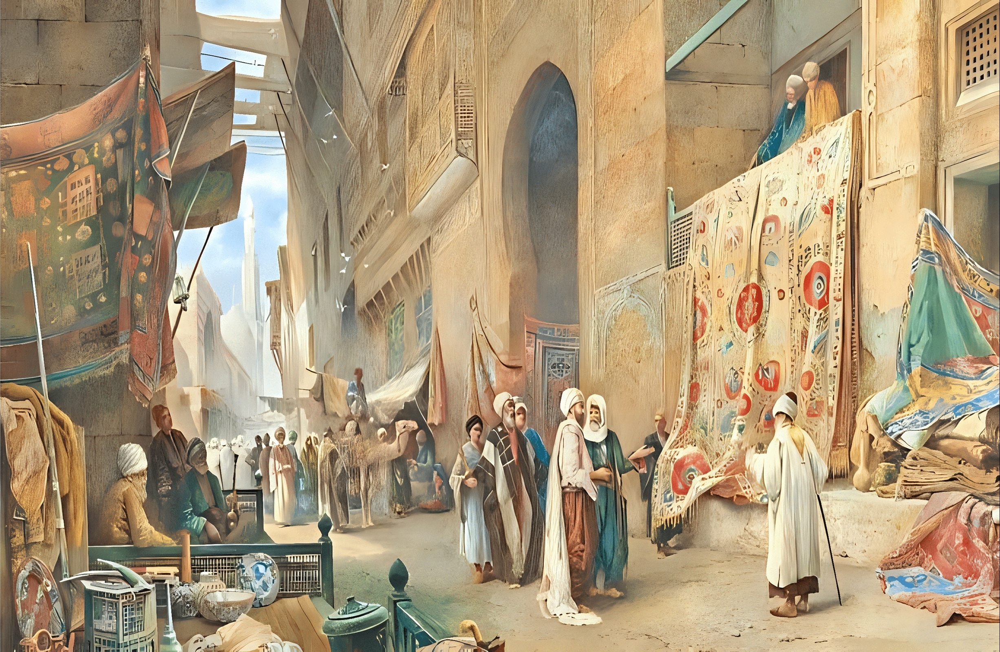
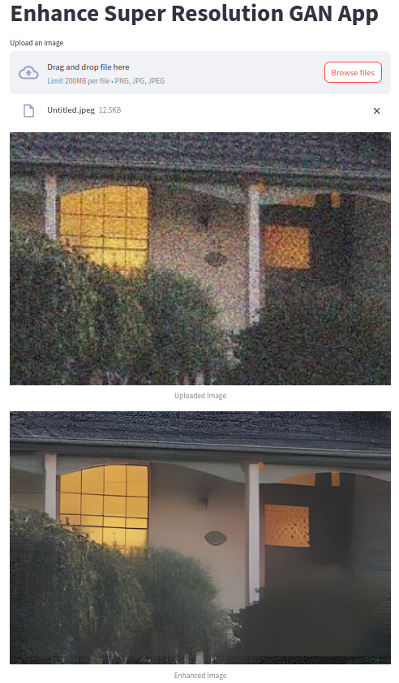

# ESRGAN-CAMERA-DRIVER 

PyTorch implementation of a Real-ESRGAN model trained on custom dataset. The ESRGAN Camera Driver is a versatile solution that empowers your camera device, be it a webcam or any other camera, to provide real-time image enhancement. Leveraging the power of ESRGAN (Enhanced Super-Resolution Generative Adversarial Network), this project elevates your visual experience by producing super-resolved, high-quality images and videos on the fly.

<p float="left">
  
   
</p>


Real-ESRGAN is an upgraded [ESRGAN](https://arxiv.org/abs/1809.00219) trained with pure synthetic data is capable of enhancing details while removing annoying artifacts for common real-world images. 

- [Paper (Real-ESRGAN: Training Real-World Blind Super-Resolution with Pure Synthetic Data)](https://arxiv.org/abs/2107.10833)
- [Original implementation](https://github.com/xinntao/Real-ESRGAN)
- [Huggingface 🤗](https://huggingface.co/sberbank-ai/Real-ESRGAN)

### Installation

```bash
pip install git+https://github.com/sberbank-ai/Real-ESRGAN.git
```


```bash
git clone https://github.com/Alaaeldinn/ESRGAN-Camera-Driver.git
```

### Usage
```bash
streamlit run streamlit_app.py
```

```bash
python webcam.py
```
---


### Examples

---
Streamlit app Demo:



